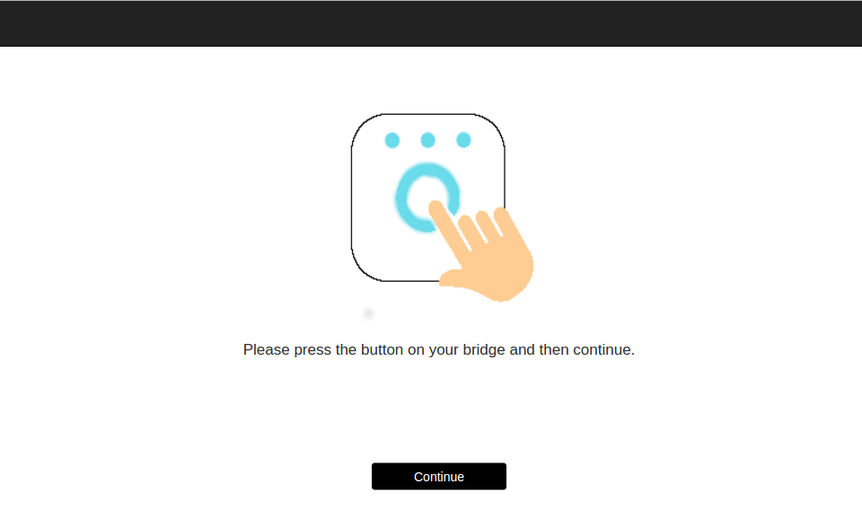

# RaveForm


###What is RaveForm?
RaveForm is an app to sync Phillips Hue lights with music. RaveForm utilizes [web audio api](https://developer.mozilla.org/en-US/docs/Web/API/Web_Audio_API) to grab sound data the users sound card. Frequency data is extracted in real time and is used to control the color and brightness Hue lights as well as display an audio visualization utilizing [HTML5 Canvas](https://developer.mozilla.org/en-US/docs/Web/API/Canvas_API).


###Pre-Setup
Before using RaveForm you'll need to do a couple of simple steps to set it up.
The first thing you will need to do is [enable stereo mix](#stereomix) so RaveForm can capture sound from your sound card. If you don't want to go through this setup process RaveForm can also listen to music through your microphone.

The second pre-setup step is setting up your light groups using the Phillips Hue App. RaveForm controls lights put into two light groups named "highs" and "lows". Put the lights you want to display high frequencies with into "highs" and low frequency lights into "lows".

<image src="assets/groups.png" title="hue groups" height="480" width="300"></image>


###Setup

Setting up Raveform is simple.
To begin running the app just fun the following commands:

```bash
git clone https://github.com/MatthewMawby/RaveForm.git
cd RaveForm
npm install
npm start
```
Once Raveform is running, open your favorite web browser and navigate to [localhost:5000](http://localhost:5000).

If this is your first time running RaveForm you will be directed to the setup page:

You will need to press the button on your hue bridge and then click the button on the screen. If the app was succesfully registered you will be redirected to the main page after clicking continue. If you are not, hit the button on the bridge and try again.

Note: In order to avoid having to setup in the future make sure you have cookies enabled - the generated username is stored as a cookie. Also note that if you run "clean up" bridge on the Phillips Hue App, you will need to clear your cookies and go through the setup process again. The first troubleshooting step you should take if you make it to the main page and RaveForm fails to control your lights is to clear your cookies and go through the setup process again.

Once you've successfuly made it past the setup process, you will be redirected to the main page:


Now that you've made it this far make sure your hue lights are on and start the music!
If audio is being captured successfully you will see the audio visualization depicted in the image above, otherwise you need to follow these [instructions](#stereomix) to enable Stereo Mix.

<h3 name="stereomix">Stereo Mix Instructions</h3>
Stereo Mix allows RaveForm to listen to the audio output from your sound card. As I only have a linux machine this readme will only cover how to enable stereo mix for Ubuntu.

Here are instructions for [Windows](http://www.howtogeek.com/howto/39532/how-to-enable-stereo-mix-in-windows-7-to-record-audio/).


###Linux Instructions:
####step 1:
Install Pulse Audio Volume Control
```bash
sudo apt-get install pavucontrol
```
####step 2:
Launch Pulse Audio Volume Control
```bash
pavucontrol
```
####step 3:
Navigate to the "recording" tab and with RaveForm running select "monitor of built in audio analog stereo" for the browser that RaveForm is running in.

